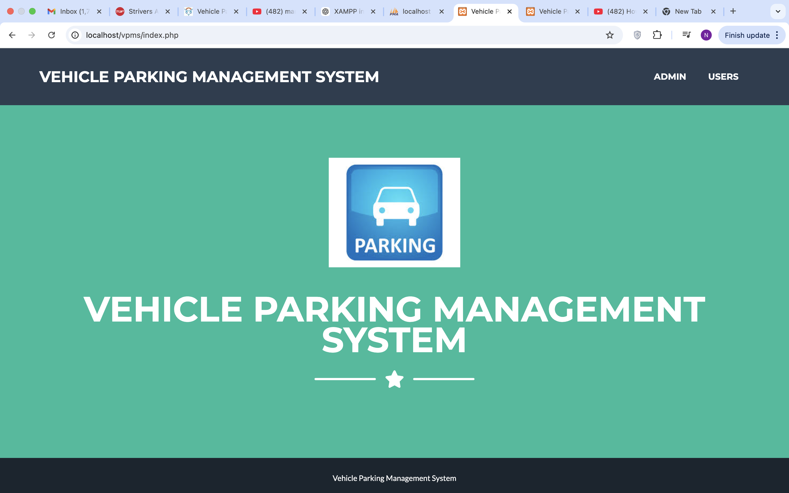
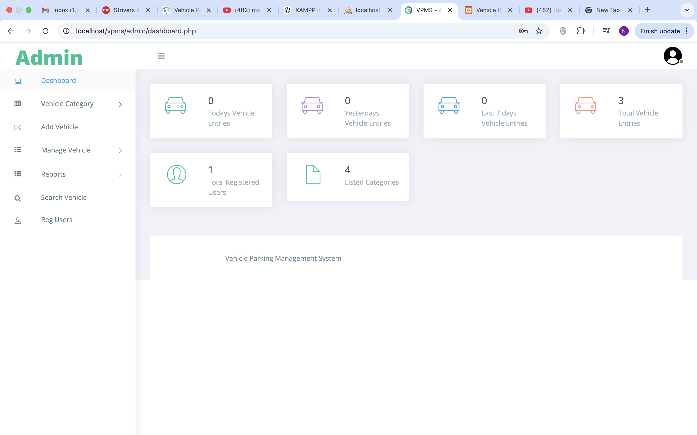
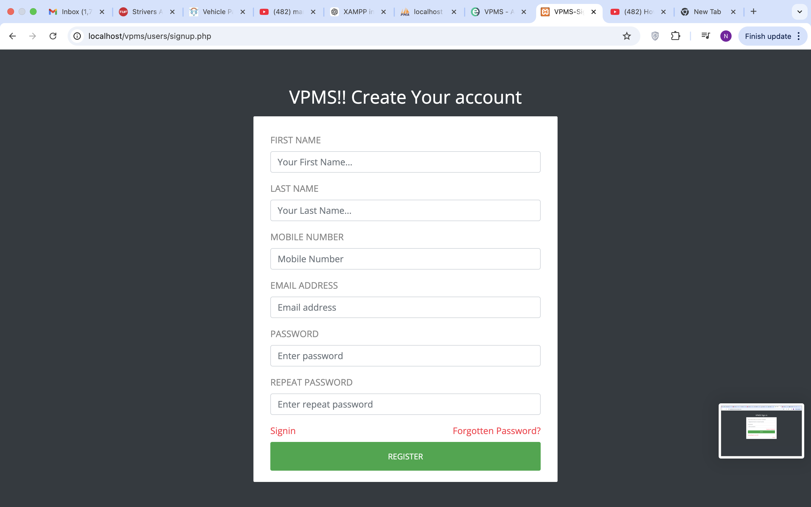
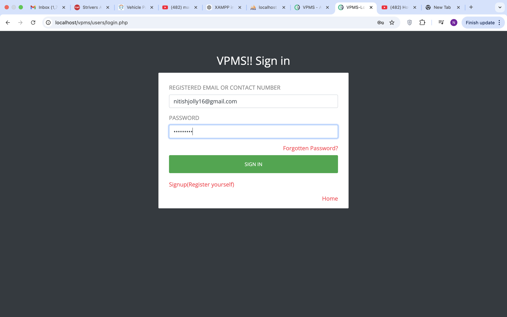
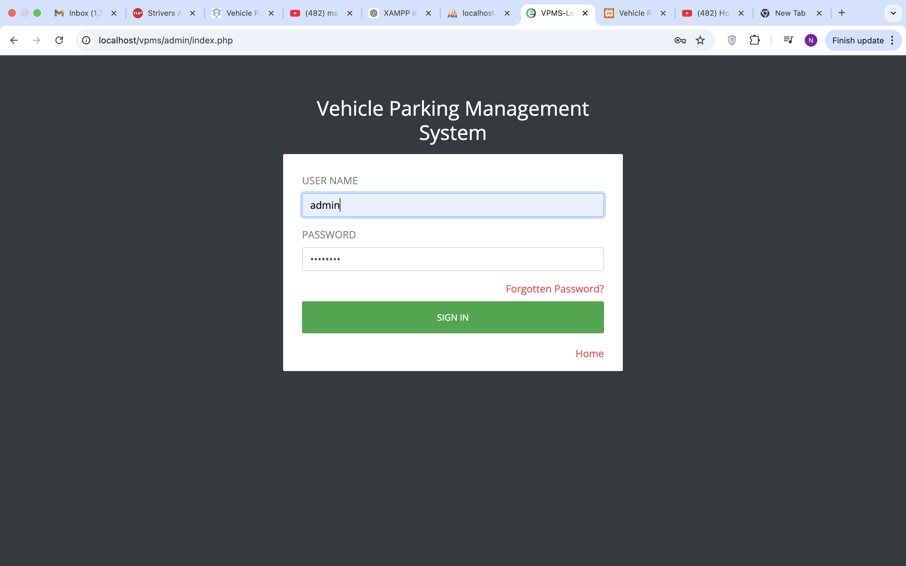

# 🚗 Vehicle Parking Management System (VPMS)

The Vehicle Parking Management System (VPMS) is a web-based application designed to efficiently manage records of incoming and outgoing vehicles in a parking facility. It streamlines parking operations by keeping accurate records and providing an intuitive interface for administrators.

---

### 🏠 Dashboard View  
  
  

### 🚗 Parking Status  
  

### 👤 User Login  
  
  

### 👤 Admin Login  
  

## 📌 Features

- **Efficient Vehicle Management:** Track and manage records of vehicles entering and exiting the parking facility.
- **Administrative Control:** Secure admin panel for managing vehicle data and generating reports.
- **User-Friendly Interface:** Intuitive design ensuring ease of use for administrators.
- **Real-Time Monitoring:** Monitor parking space availability and vehicle status in real-time.
- **Reporting:** Generate comprehensive reports on parking usage and vehicle details.

---

## 🛠️ Technologies Used

- **Front-End:**
  - HTML5
  - CSS3
  - JavaScript
- **Back-End:**
  - PHP
  - MySQL
- **Additional Libraries:**
  - jQuery
  - Bootstrap

---
